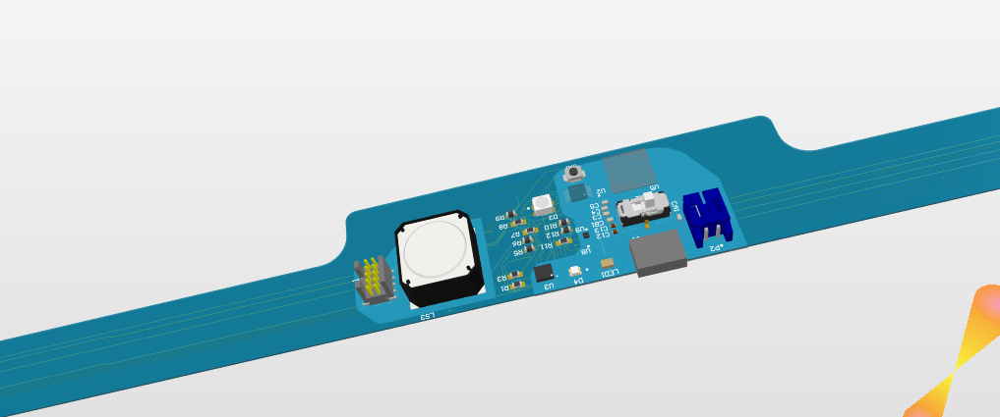
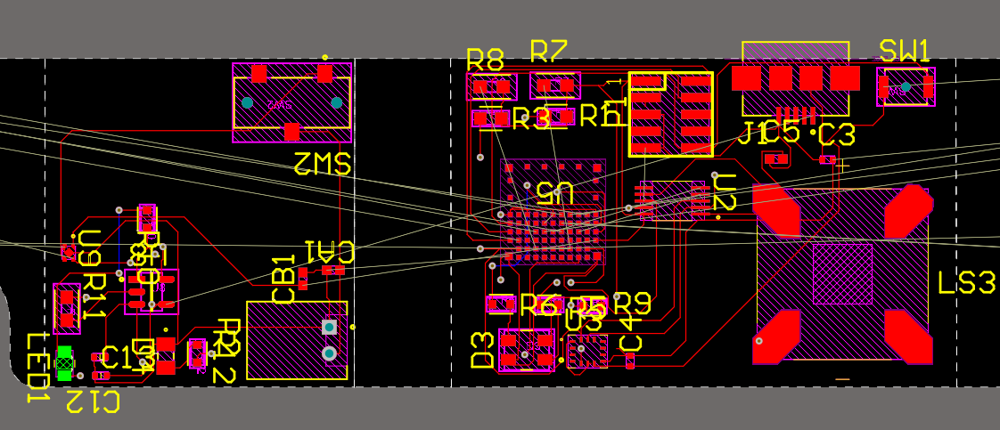

# Neck Posture Rehab Patch
A lightweight, discreet neck-posture coach built on **nRF5340 + IMU**, providing real-time pitch/dwell estimation with **LRA haptics** and an optional **Peltier thermal cue**. The device connects over **BLE** for status streaming and parameter tuning.

> **What**: A wearable that senses head-neck posture and gently nudges you back to neutral.  
> **Why**: Prolonged forward-head posture is common with laptops/phones; this patch offers an adaptive, comfortable alternative to rigid braces.

---

## 📷 Bench & Design Gallery

  

<em>Figure 1 — Driver bench test (H-bridge + PWM + thermistor ADC). Used for LRA and Peltier bring-up.</em>

  

<em>Figure 2 — Preliminary appearance concept for the flex PCB / enclosure.</em>

  

<em>Figure 3 — PCB Layout Rev-A snapshot: IMU, H-bridge, thermistor front-end, battery path.</em>

---

## ✨ Key Features
- **Real-time posture estimation**: 6-DoF IMU with *Madgwick* fusion for head-pitch tracking and **dwell time** measurement.
- **Fewer false triggers**: **Dynamic baseline** (adapts to user’s neutral drift) + **hysteresis thresholds** to avoid chatter.
- **Multi-modal feedback**:
  - **LRA haptics** with multiple intensity levels.
  - **Peltier thermal cue**: subtle skin-level warmth as a secondary, less intrusive signal.
- **BLE connectivity**: Custom **GATT** service for state notifications and command/control.
- **Safety & reliability**: Temperature/current limits, watchdog, emergency stop, error logging; OTA-ready (optional).
- **Early result**: Initial pilot suggests improved correction adherence over one week (larger study planned).

---

## 🧩 System Overview
- **MCU/SoC**: Nordic **nRF5340** (Zephyr RTOS) *(ESP32-S3 prototype supported)*  
- **Sensors**: BMI270 or ISM330DHCX (6-DoF IMU)  
- **Actuators**: LRA + driver; **Peltier + NTC** thermistor (optional)  
- **Connectivity**: BLE  
- **Power**: Single-cell Li-ion with charge/protection circuitry

### Thermal Subsystem (Peltier)
- **Purpose**: Provide a *gentle, low-salience* cue (warmth) when poor posture persists beyond a dwell threshold.
- **Control**: PWM-driven H-bridge → Peltier; closed-loop temperature control via **NTC** (skin-surface proxy).  
- **Algorithms**: NTC linearization, **slew-rate limiting**, and anti-windup.  
- **Safety limits (typical)**:
  - Skin-surface temperature cap (e.g., **≤ 42 °C** configurable)
  - Current limit with fold-back
  - Auto cool-down on over-temp / fault
- **Current HW rev**: Heating-focused; active cooling direction is possible with the H-bridge but disabled by default.

> ⚠️ **Note**: Thermal feedback targets *noticeable but comfortable* warmth. Actual limits should be validated per regulatory and dermatological guidance for wearables.

---

## 🔎 Current Status
- ✅ IMU fusion, posture logic, multi-level vibration  
- ✅ Peltier closed-loop heating with temp cap & current limit (pilot)

